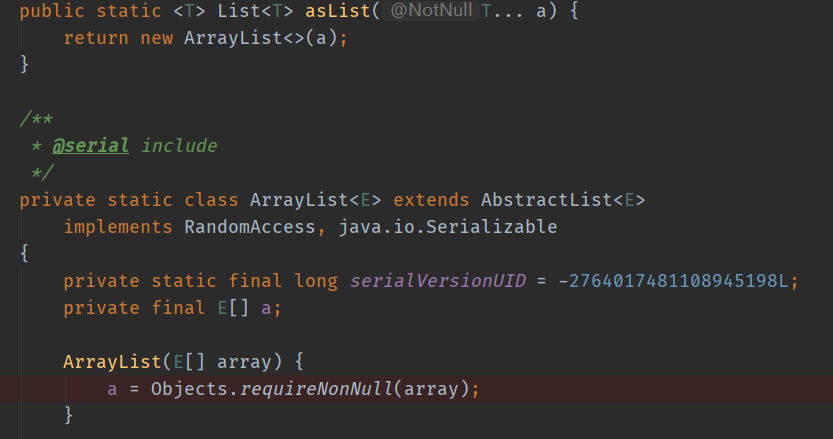

# AsList()方法详解

在Java中，我们应该如何将一个数组array转换为一个List列表并赋初始值？首先想到的肯定是利用List自带的add()方法，先new一个List对象，再使用add()方法将数组array中的值一个一个放入。这种方法固然可行，但是比较繁琐。那么有没有稍微简单一点的方法呢？Arrays.asList()方法可以作为一个解决方案。

首先放上asList()方法的源代码，会在后续分析中使用。



使用Arrays.asList()方法时，需要注意以下几点：

### 1、不支持add()、remove()、clear()等方法 

使用上述方法在编译时并不会报错，而在运行时会抛出**java.lang.UnsupportedOperationException**错误。

```java
import java.util.Arrays;
import java.util.List;

public class AsListTest {
    public static void main(String[] args) {
        String[] s = {"a", "b", "c"};
        List list = Arrays.asList(s);
        list.add("d");
    }
}

// 结果：
// Exception in thread "main" java.lang.UnsupportedOperationException
```

究其原因，是因为此方法并未创建Util包下的List实现类，而是在Arrays.java包下自定义了一个ArrayList类。如上图所示，为asList()方法，这个类并未实现add()等方法，而是直接使用父类AbstractList的相应方法，导致报错。因此需要注意的是，使用该方法时，不能对转化后的List进行增加或删除操作，只能进行读取或修改。

### 2、基本数据类型数组转换后使用size()方法时返回不正确

当数组为基本数据类型的数组时，将数组转换为List后，使用List.size()方法获取List长度不正确。

```java
import java.util.Arrays;
import java.util.List;

public class AsListTest {
    public static void main(String[] args) {
        int[] i = {1, 2, 3};
        List list = Arrays.asList(i);
        System.out.println(list.size());
    }
}

// 结果：1
```

究其原因，是因为构造方法传入了一个泛型数组参数，但是由于int[]本身就是一个类型，所以编译器认为只传了一个变量，这个变量的类型是int数组，结构为int(1)()，因此size为1。 

由上述分析，因为基本数据类型数组转换后使用size()方法时返回不正确，根据索引对转换后List进行修改也会出现错误。因此，不要对基本数据类型数组进行转换，尽量使用基本数据类型的包装类，如：Integer等。

### 3、对List或Array其中一个进行修改，另一个也会相应改变

```java
import java.util.Arrays;
import java.util.List;

public class AsListTest {
    public static void main(String[] args) {
        String[] s = {"a", "b", "c"};
        List list = Arrays.asList(s);

        s[0] = "b";
        System.out.println("Array:"+Arrays.toString(s));
        System.out.println("List:"+list);

        list.set(1, "c");
        System.out.println("Array:"+Arrays.toString(s));
        System.out.println("List:"+list);
    }
}

// 结果：
// Array:[b, b, c]
// List:[b, b, c]
// Array:[b, c, c]
// List:[b, c, c]
```

从上面结果可以看出，对List或Array其中一个进行修改，另一个也会相应改变。这是因为由asList()方法生成的List仅是对Array进行了一层包装，对List进行操作实际还是对初始Array的操作。

